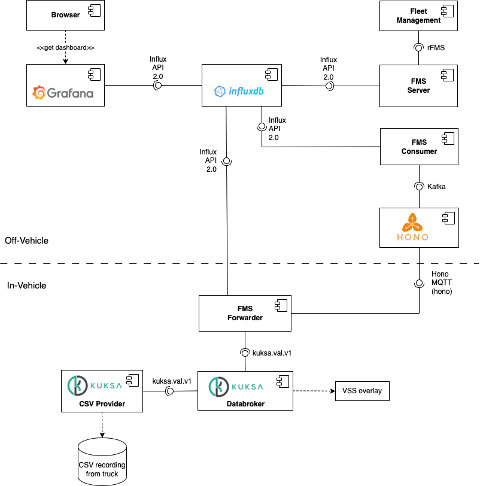

# Extend the Fleet-Management Blueprint

## About

The idea of the challenge is to extend the Eclipse SDV Blueprint on [fleet-management](https://github.com/eclipse-sdv-blueprints/fleet-management).

The [Eclipse SDV Blueprints](https://github.com/eclipse-sdv-blueprints) project is a collaborative initiative
led by Eclipse SDV members to bring the *software defined vehicle* concepts to life.

The fleet management blueprint is a close to *real-life* showcase
for truck fleet management, where trucks run an SDV software stack so that logistics fleet operators can
manage apps, data, and services for a diverse set of vehicles.

The use case illustrates how the standard [Vehicle Signal Specification model (VSS)](https://covesa.github.io/vehicle_signal_specification/) can be customized and used to report data from a vehicle
to a back end.

Within the hackathon, we are looking forward to your ideas for potential features and technologies to integrate into the blueprint, like, but not limited, to fleet range-prediction or better data sampling and campaign management.

## Need to know

The fleet management blueprint consists of [Eclipse Leda](https://eclipse-leda.github.io/leda/), [Eclipse Kanto](https://github.com/eclipse-kanto), [Eclipse Kuksa](https://eclipse-kuksa.github.io/kuksa-website/), [Eclipse Hono](https://github.com/eclipse-hono/hono), InfluxDB, Grafana, and Docker Compose. A basic understanding of these technologies and the Vehicle Signal Specification (VSS) is helpful to get started right away but is not required. Therefore, we look forward to discussing and seeing how the technologies that you are knowledgeable of can be good extensions of the blueprint.



## Hack-Coaches

- Sven Jeroschewski
- Lukas Mittag

## Template Setup

The initial setup is as described in the [fleet management repository](https://github.com/eclipse-sdv-blueprints/fleet-management) in Eclipse SDV blueprints. For the in-vehicle components, we recommend either deploying them to Eclipse Leda running in QEMU or as part of the Docker Compose setup, which you will run anyway for the off-vehicle components. To deploy the complete blueprint with Docker Compose, download the repository and execute:

```
docker compose -f ./fms-blueprint-compose.yaml up --detach
```

## all necessary links

- Eclipse SDV Blueprint Fleet Management: https://github.com/eclipse-sdv-blueprints/fleet-management
- Vehicle Signal Specification (VSS): https://covesa.github.io/vehicle_signal_specification/
