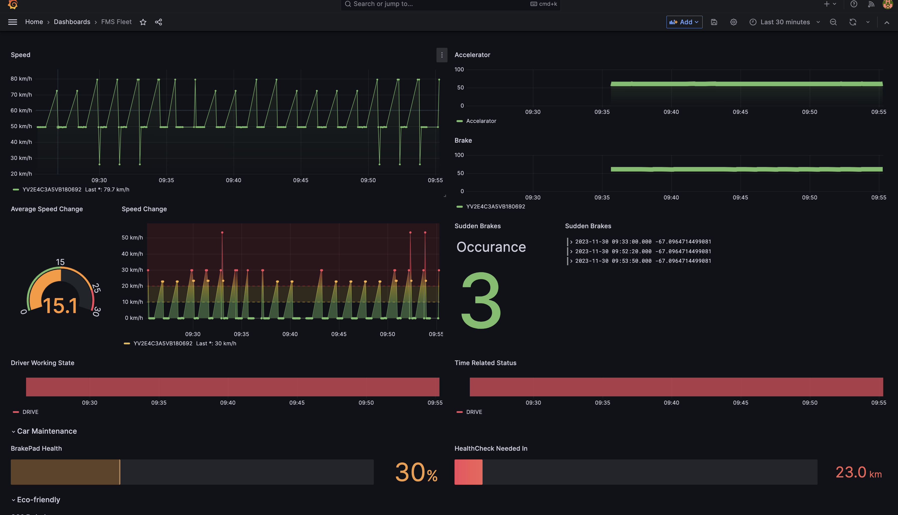
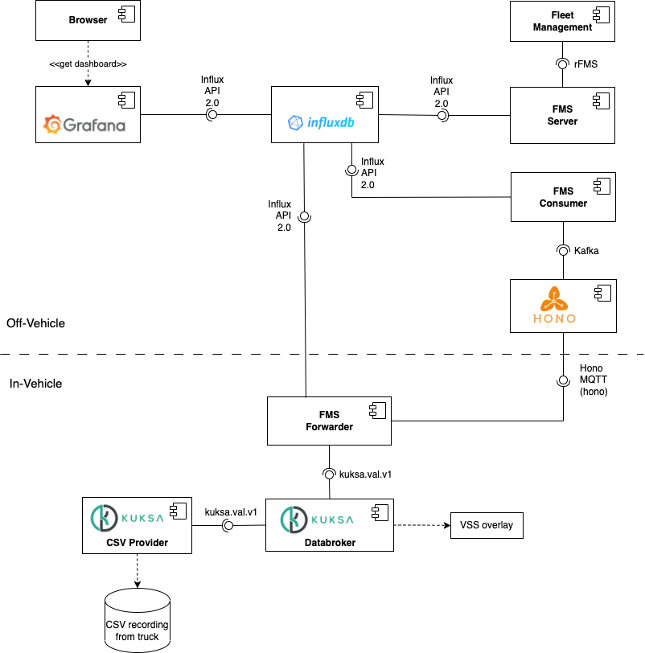

# Fleet Flow
The **Fleet Flow** is a open source based driving analyzing application. We analyze various data which related driving history, car maintenance and eco-friendly.

---

Fleet Flow score and visualize drivers to drive more safely, and eco-friendly. This application is designed for car rental companies to manage the safety and maintenance of their fleet. It enables users to monitor drivers' status, service-to-distance, speed, trip duration, and more. By ensuring timely maintenance or efficiency, the app helps prevent failures and enhances driver productivity. Additionally, it offers the potential to save on insurance costs by presenting data that demonstrates a reduced likelihood of accidents to insurance companies.The best point of this application is that the user can check all of data to save money in real-time.

Here is data you can check:
- Driver's status (Drive, Stop and Available)
- Remaining distance to maintenance service
- Vehicle's speed and average speed
- Vehicle's brake and acceleration
- Number of hard brake, acceleration and 
- Brake Pad Health
- Trip duration
- Co2 emission
- Fuel consumption
- Driving Score 

Every data is based on [vss.json spec](/spec/overlay/vss.json), so if the car or simulator is following the format, application will work fine.

A new endpoint, rfms/insurancereport, was meant to be implemented in the frms server. This endpoint is designed to receive a Vehicle Identification Number (VIN) as a query parameter and, in turn, generate a .json file. The contents of this file mirror the information currently presented on the dashboard. This addition not only expands the capabilities of our system by facilitating targeted data retrieval but also offers users a convenient means to access and utilize detailed vehicle information. Unfortnatly, the changes to the frms server did not work at the time the hackathon ended. <br>

# Demo


# How to run
1. Clone the repository
2. run docker-compose up
3. go to http://localhost:3000 (username: admin, password: admin)
```
git clone
cd Fleet-Flow/
docker compose -f ./fms-blueprint-compose.yaml up
```

# Architecture

